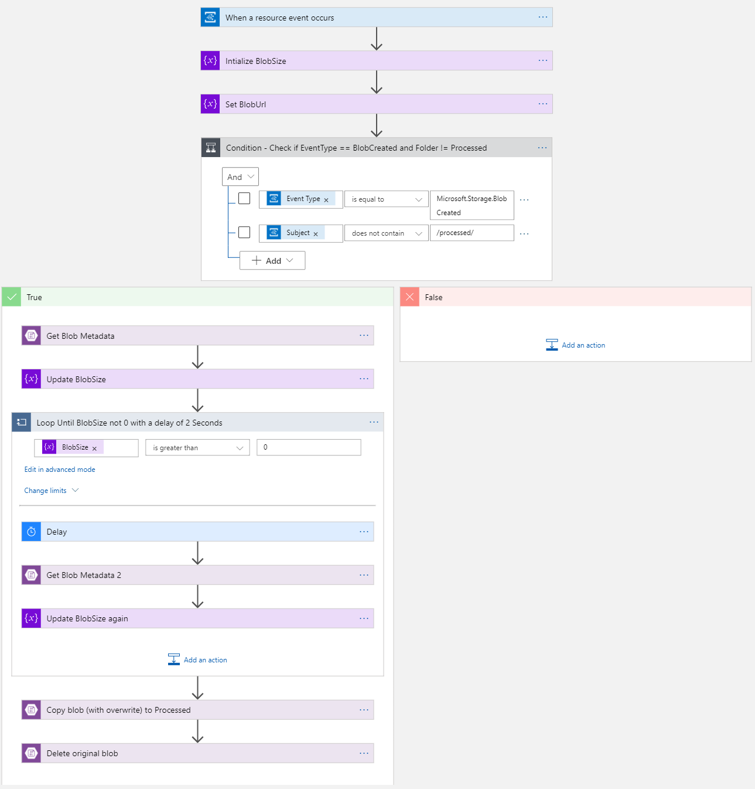
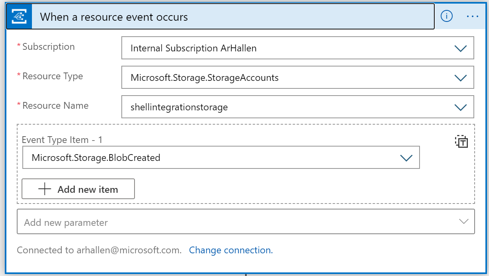
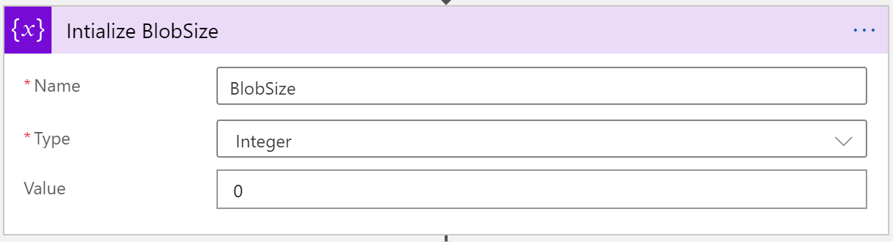
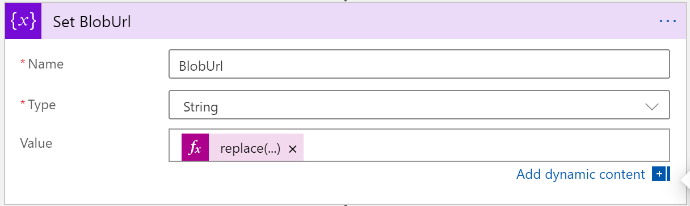
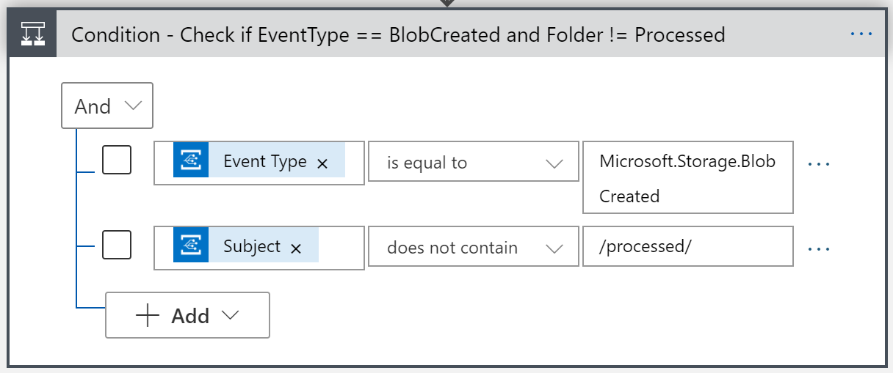
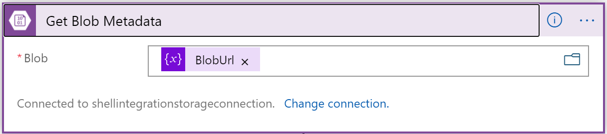
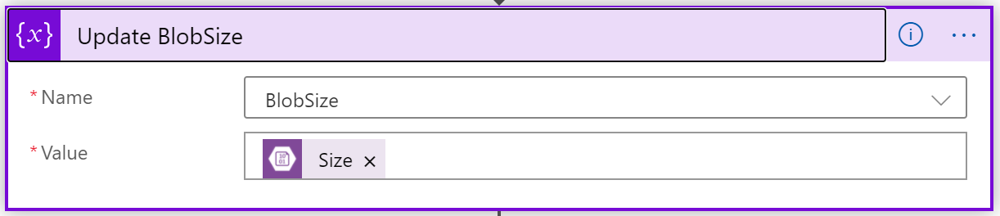
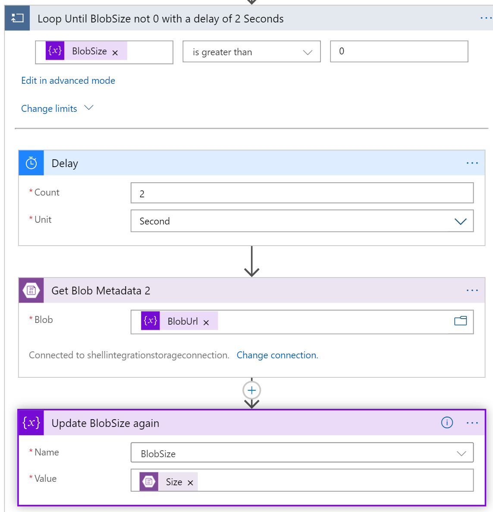
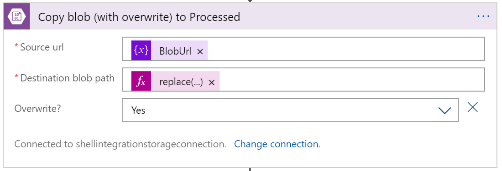
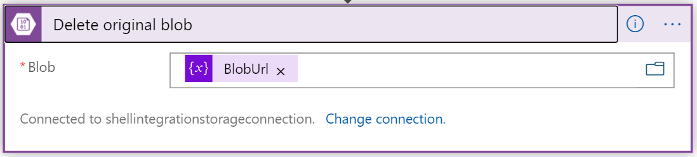

# EventGridToLogicAppWithLargeFiles

Whenever a file is created in Blob Storage that has an Event Grid Subscription attached, the BlobCreated Event is fired at the creation of the file (which is good), but it might take some time for the file to be fully uploaded (which can cause some issues when subsystems start processing during that time). As the file remains 0 bytes until the upload is completed, this Logic App simply loops with a delay of a few seconds and checks the file size for being greater than 0. If so, processing of the file can start (in this sample a simple copy to a folder named 'processed' and the deletion of the original file. This allows for the same file to be uploaded again for re-processing) 

Logic App overview
 

When an Event is received from Event Grid
 

Initialize BlobSize variable to check if it is bigger than 0 
 

Intialize Blob Url varable based on Subject of Event

replace(replace(triggerBody()?['subject'],'/blobServices/default/containers',''), 'blobs/', '')

 

Check if Event Type is BlobCreated and Path does not contain '/processed/' (to avoid endless processing of files) 
 

Get Blob Metadata 
 

Set BlobSize variable to Size property of blob metadata 
 

Loop Until Size Greater Than 0 and delay each iteration for 2 seconds 
 

In this sample, the only 'processing'  done is to copy the blob to another folder by replacing a string in the path: 

'''
replace(variables('BlobUrl'), '/notprocessed/', '/processed/')
'''

 

Delete the original Blob so the process can be repeated. 
 